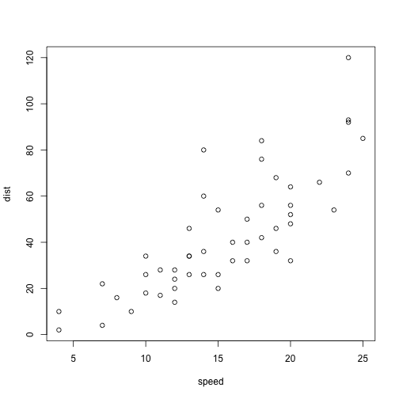

Cars Data Presentation
========================================================
author: Vladimir Martinov
date: 08/25/2019
autosize: true

Description
========================================================

The application explores bin widths (or the number of bins) affect a histogram. The histogram below is for the Cars data set. The observations are the stopping distance (in feet). Users can interactively change the bin width by dragging the arrow underneath the bin width scale.


Cars Dataset
========================================================


```r
summary(cars)
```

```
     speed           dist       
 Min.   : 4.0   Min.   :  2.00  
 1st Qu.:12.0   1st Qu.: 26.00  
 Median :15.0   Median : 36.00  
 Mean   :15.4   Mean   : 42.98  
 3rd Qu.:19.0   3rd Qu.: 56.00  
 Max.   :25.0   Max.   :120.00  
```

Plot of the Data
========================================================



Application - ui.R
========================================================


```r
library(shiny)

# Define UI for application that draws a histogram
shinyUI(fluidPage(
    
    # Application title
    titlePanel("Cars Data"),
    
    # Sidebar with a slider input for number of bins
    sidebarLayout(
        sidebarPanel(
            sliderInput("bins",
                        "Number of bins:",
                        min = 1,
                        max = 10,
                        value = 5)
        ),
        
        # Show a plot of the generated distribution
        mainPanel(
            plotOutput("distPlot")
        )
    )
))
```

<!--html_preserve--><div class="container-fluid">
<h2>Cars Data</h2>
<div class="row">
<div class="col-sm-4">
<form class="well">
<div class="form-group shiny-input-container">
<label class="control-label" for="bins">Number of bins:</label>
<input class="js-range-slider" id="bins" data-min="1" data-max="10" data-from="5" data-step="1" data-grid="true" data-grid-num="9" data-grid-snap="false" data-prettify-separator="," data-prettify-enabled="true" data-keyboard="true" data-data-type="number"/>
</div>
</form>
</div>
<div class="col-sm-8">
<div id="distPlot" class="shiny-plot-output" style="width: 100% ; height: 400px"></div>
</div>
</div>
</div><!--/html_preserve-->

Application - server.R
========================================================

```r
library(shiny)

# Define server logic required to draw a histogram
shinyServer(function(input, output) {
    
    output$distPlot <- renderPlot({
        
        # generate bins based on input$bins from ui.R
        x    <- cars[, 2]
        bins <- seq(min(x), max(x), length.out = input$bins + 1)
        
        # draw the histogram with the specified number of bins
        hist(x, breaks = bins, col = 'maroon', border = 'white')
        
    })
    
})
```
